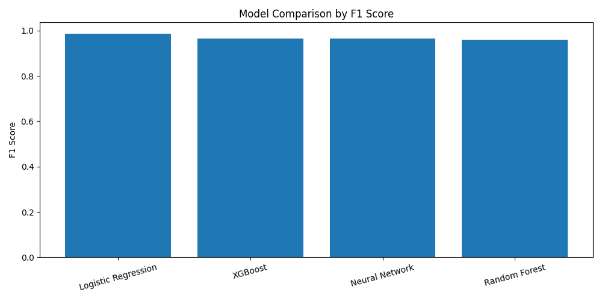
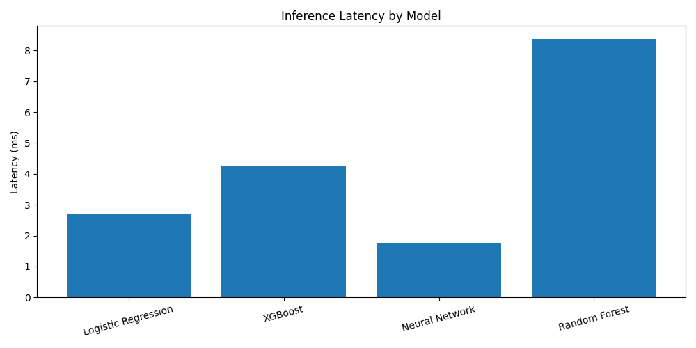
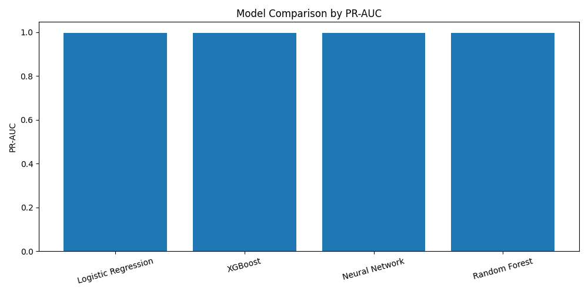

# Production ML Benchmarking & Optimization Framework
Built an automated benchmarking pipeline comparing Logistic Regression, Random Forest, XGBoost, and Neural Networks using Optuna hyperparameter tuning.

## Why This Matters
In real-world ML systems, model selection is not just about accuracy but also latency and scalability.  
This project demonstrates how simpler models can outperform complex ones while being significantly faster, which is critical for production environments.

## Results
- F1-score: 0.986
- PR-AUC: 0.997
- Latency: ~2.7 ms

## Model Comparison
### F1 Score

### Latency

### PR-AUC

## Key Insight
A key finding was that simpler models (Logistic Regression) outperformed more complex models like XGBoost and Neural Networks while achieving 2–4× lower inference latency.
This highlights the importance of balancing performance with efficiency in production ML systems.

## Tech Stack
Python, Scikit-learn, XGBoost, Optuna, NumPy, Pandas, Matplotlib

## Run
pip install -r requirements.txt
python benchmark.py
